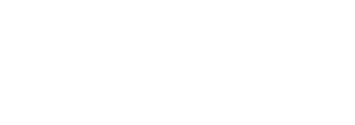
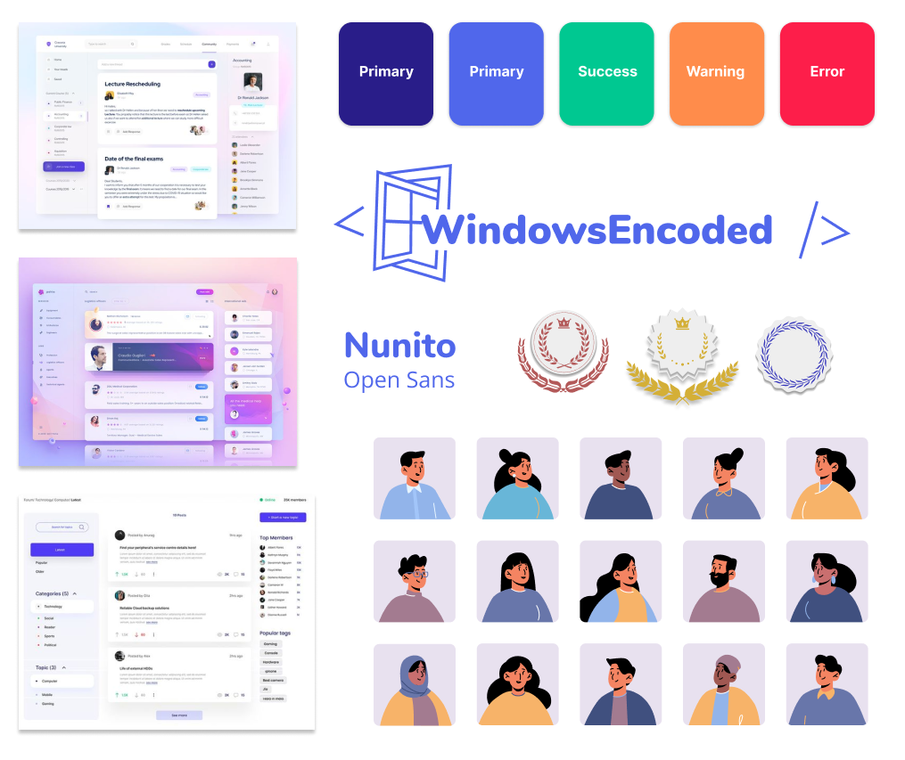
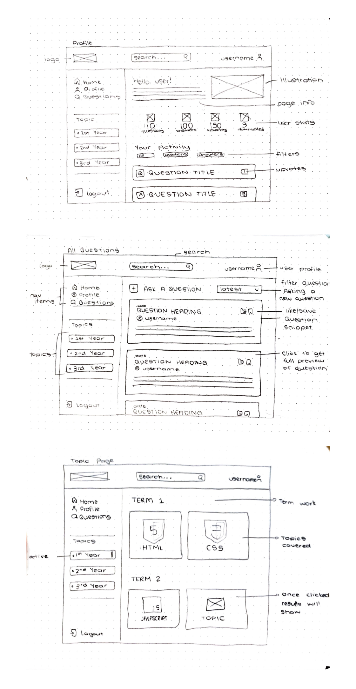
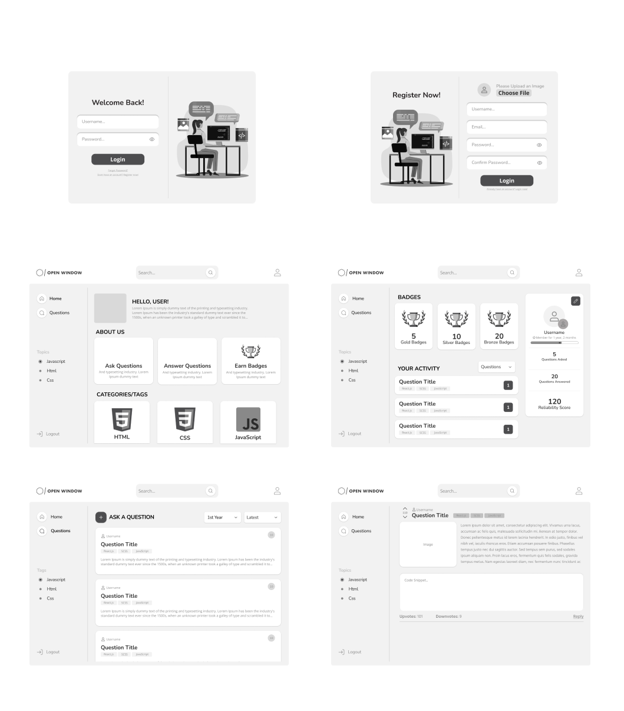
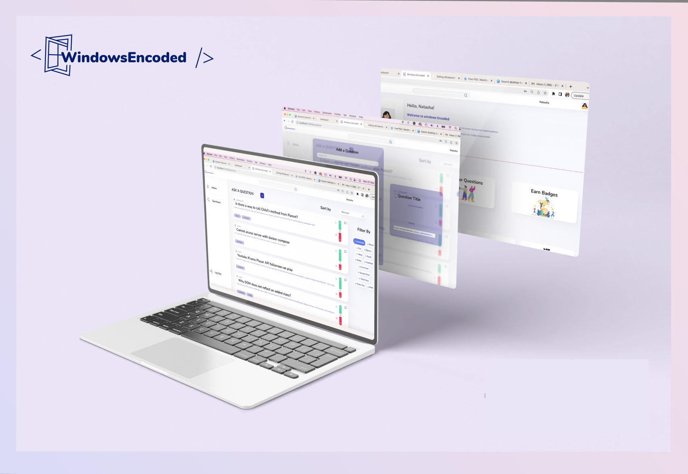
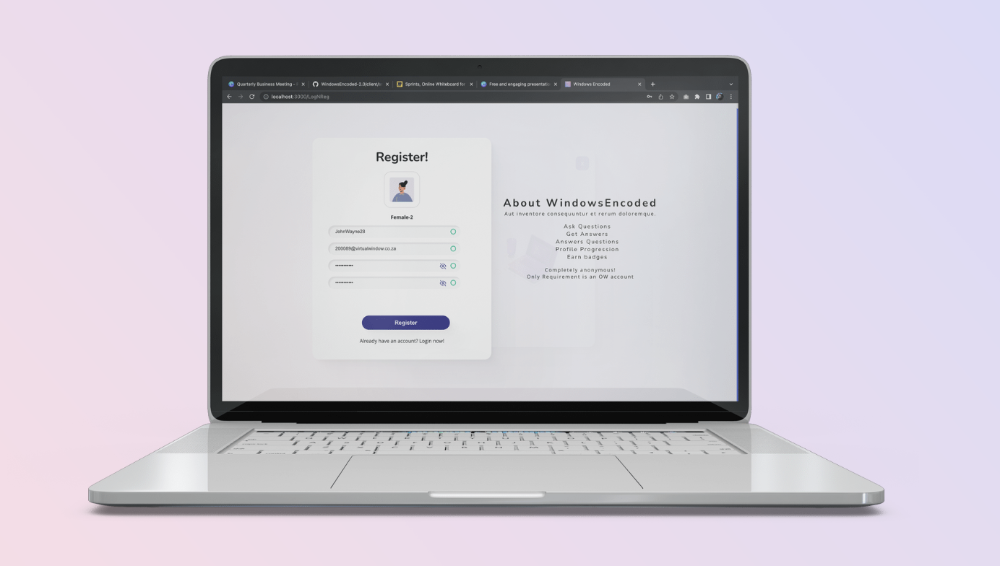
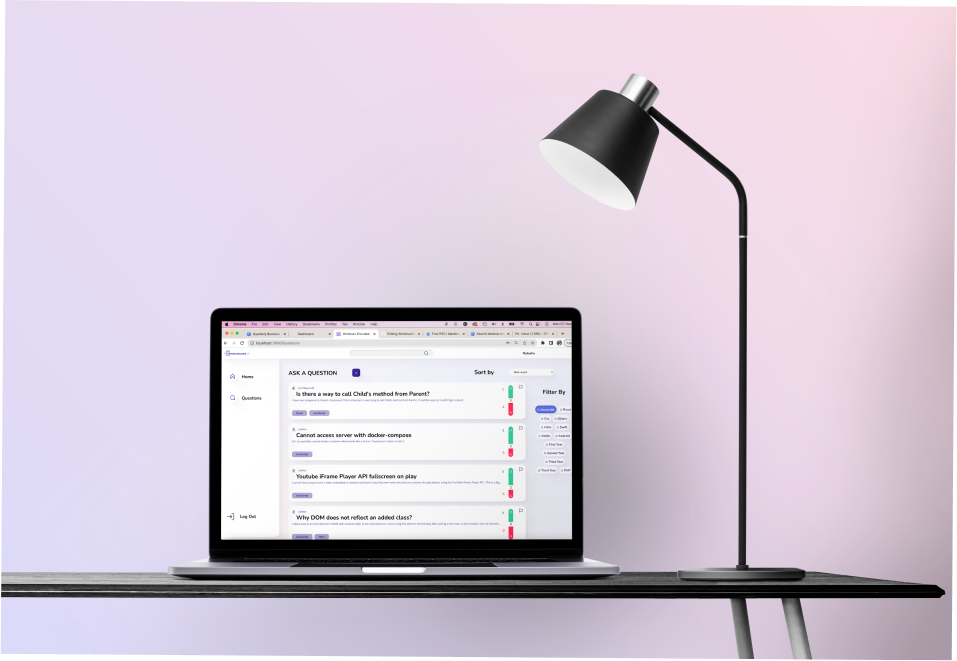
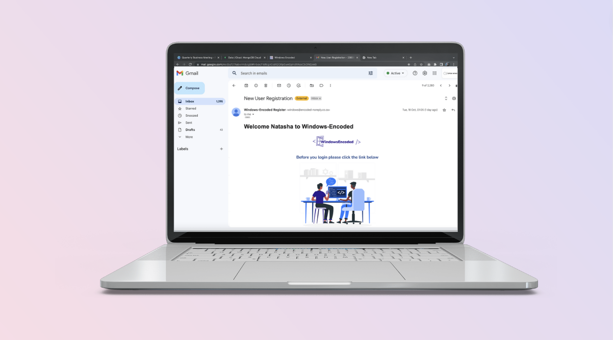

## Repo Info


Bronwyn Potgieter 200089
<br/>
Justin Koster 200100
<br/>
Natasha Jansen van Rensbug 21100474
<br/>
Reinhardt de Beer 21100115

# WINDOWS ENCODED - Development Term 4

<p align="center">
    
</p>

Windows Encoded is a forum for Open Window Interactive Development Students where they can ask and answer questions based on the content being tought throughout the year. Questions and answers can be upvoded and downvoted which will impact the users reputation and overall score. Based on this score, badges can be earned leading the user one step closer to becoming an admin! This project was built using Mongo, Express, React and Node.js.

## Table of contents

- [Installation](#Installation)
- [Built With](#Build-With)
- [Features](#Features-and-Functions)
- [Development-Process](#Development-Process)
  - [Ideation](#Ideation)
  - [Wireframes](#Wireframes)
  - [Challenges](#Challenges)
  - [Above and Beyond](#Above-And-Beyond)
  - [Future Implementation](#Future-Implementation)
- [Final-Outcome](#Final-Outcome)
  - [Mockups](#Mockups)
  - [Video-Demonstration](#Video-Demonstration)
  - [Final-Outcome](#Final-Outcome)
- [Authors](#Authors)
- [License](#License)
- [Contact](#Contact)
- [Acknowledgements](#Acknowledgements)

## Installation

1.  GitHub Desktop </br>
    Enter `https://github.com/EpicBlue1/WindowsEncoded-2.0.git` into the URL field and press the `Clone` button.

2.  Clone Repository </br>
    Run the following in the command-line to clone the project:

    ```sh
    git clone https://github.com/EpicBlue1/OOP_21100115_ReinhardtdeBeer.git
    ```

        Open `Software` and select `File | Open...` from the menu. Select cloned directory and press `Open` button

3.  Install Dependencies </br>

Run the following in the command-line to install all the required dependencies inside the server and client folder:

```sh
npm i
```

4. An API key is not required

## Build With

| Name           | Link                                |
| -------------- | ----------------------------------- | ---------------------------------- | --- |
| <p>Node Js</p> | https://nodejs.org/                 |
| <p>MongoDB</p> | https://www.mongodb.com/            |
| <p>multer</p>  | https://github.com/expressjs/multer |
| <p>Express</p> | https://expressjs.com/              |
| <!--           | <p>Bootstrap React</p>              | https://react-bootstrap.github.io/ | --> |

## Features and Functions

- Log, Register, Authenticate, Validate and Logout users
- Data protection Bcrypt
- Post and answer questions
- Upvote and Downvote questions and answers
- Filter Answers based on votes
- Filter Questions Based on Language
- Users accumulate points based on their upvotes and downvotes
- User earns badges based on accumulated points
- Flagged questions
- Admins can delete flagged questions

## Development Process

### Ideation

<p align="center">
    
</p>

### Wireframes

<!-- TODO: Add Wireframes -->

Initial wireframes:

<p align="center">
    
</p>

Final wireframes:

<p align="center">
    
</p>

## Challenges

- Not focussing on the core functionality first.
- Server crashes (the result of a spelling mistake, the way I pass my data to the backend, and so on.)
- Keeping track of props ( I utilized a lot of props I kept losing track, a better alternative would be sessionstorage.)

## Above And Beyond

- Show and Hide Password
- Edit UserName
- Loading indicators on the LogIn and Question pages
- Users are able to skip the LogIn process
- Profile images are sorted on the DB for future uploads
- Users can only upvote or downvote once
- Test page for debugging and development

## Future Implementation

- Sort out re-rendering on profile page
- Work on more Admin Functionality and flexibility
- Sort out re-rendering on profile page
- Work on add question and preview question modal styling

## Final Outcome

## Mockups

<!-- TODO: Add Mockups -->
<p align="center">
    
    
    <br/>
    
    
</p>

<br/>

## Video Demonstration

To see a run through of the application, click below:

<!-- TODO: Add Video Demo -->

[View Demonstration](https://youtu.be/DBMcaTIUYoc)

## Authors

- **Bronwyn Potgieter** - [bee2805](https://github.com/bee2805)
- **Justin Koster** - [Justin-OwiStudent](https://github.com/Justin-OwiStudent)
- **Natasha Jansen van Rensbug** - [T2sha](https://github.com/T2sha)
- **Reinhardt de Beer** - [EpicBlue1](https://github.com/EpicBlue1)

## License

Distributed under the MIT License. See `LICENSE` for more information.

## Contact

- **Bronwyn Potgieter** - [200089@virtualwindow.co.za](mailto:200089@virtualwindow.co.za) - [@bronns_designs](https://www.instagram.com/bronns_designs/)

- **Justin Koster** - [200100@virtualwindow.co.za](mailto:200100@virtualwindow.co.za) - [@rdb_fotopatat](https://www.instagram.com/rdb_fotopatat/)

- **Natasha Jansen van Rensbug** - [21100474@virtualwindow.co.za](mailto:21100474@virtualwindow.co.za) - [@rdb_fotopatat](https://www.instagram.com/rdb_fotopatat/)

- **Reinhardt de Beer** - [21100115@virtualwindow.co.za](mailto:21100115@virtualwindow.co.za) - [@rdb_fotopatat](https://www.instagram.com/rdb_fotopatat/)

- **Project Link** - https://github.com/EpicBlue1/WindowsEncoded-2.0

## Acknowledgements

- **Show/Hide Password** - [Programming With Prem](https://www.youtube.com/watch?v=4kx44fbNZ-Y&t=277s)
- **Icons** - [SWM Icon Pack](<https://www.figma.com/file/Y06WSIqH4hJ6UpGAlbBKvu/SWM-Icon-Pack-(Community)?node-id=202%3A304>)
